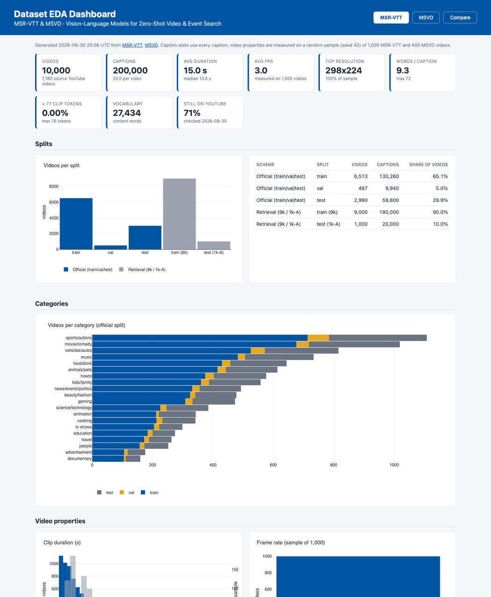
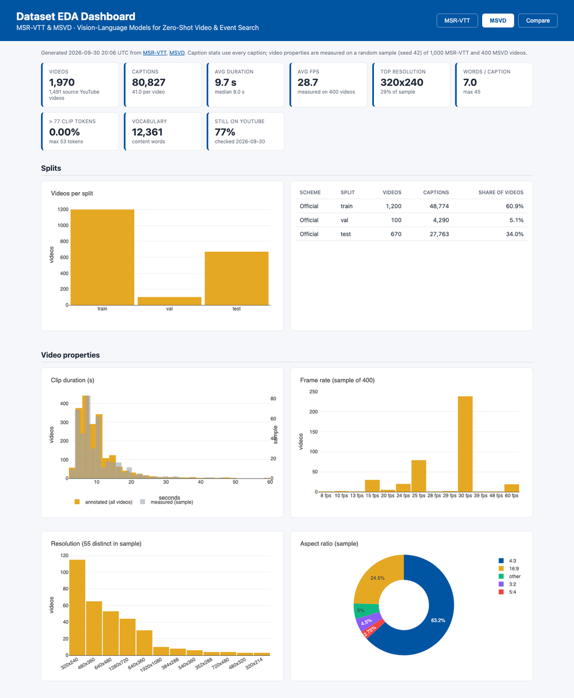
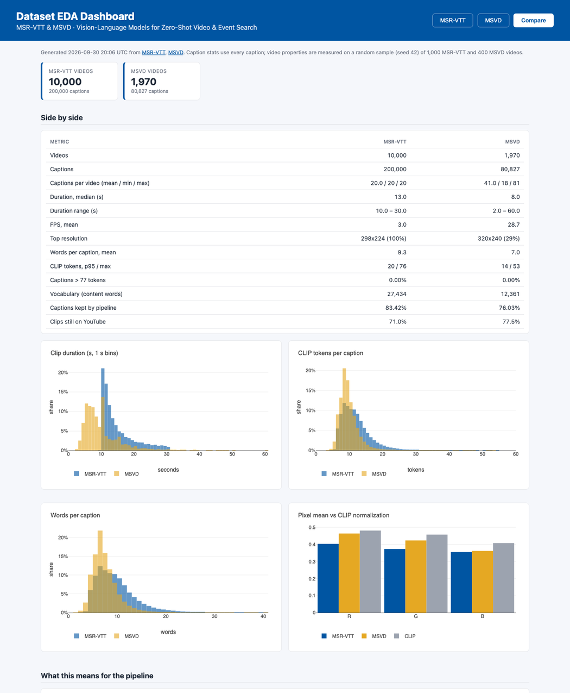

# EDA Results: MSR-VTT and MSVD

Generated 2026-09-30 20:06 UTC by `EDA/dashboard/build_data.py`. Do not edit by hand; re-run the script to refresh. Open `index.html` for the interactive version.

Caption statistics use every caption. Video properties are measured on a random sample (seed 42) of 1,000 MSR-VTT and 400 MSVD videos.

## Overview

| Metric | MSR-VTT | MSVD |
|---|---|---|
| Videos | 10,000 | 1,970 |
| Source YouTube videos | 7,180 | 1,491 |
| Captions | 200,000 | 80,827 |
| Captions per video (mean / min / max) | 20.0 / 20 / 20 | 41.0 / 18 / 81 |
| Duration mean / median (s) | 15.0 / 13.0 | 9.7 / 8.0 |
| Duration range (s) | 10.0 – 30.0 | 2.0 – 60.0 |
| FPS mean (sample) | 3.0 | 28.7 |
| Distinct resolutions (sample) | 1 | 55 |
| Top resolution (sample) | 298x224 (100%) | 320x240 (29%) |
| Words per caption mean / max | 9.3 / 72 | 7.0 / 45 |
| CLIP tokens p95 / max | 20 / 76 | 14 / 53 |
| Captions > 77 CLIP tokens | 0.00% | 0.00% |
| Vocabulary (content words) | 27,434 | 12,361 |
| Captions kept by pipeline text rules | 83.4% | 76.0% |
| Clips still on YouTube | 71.0% | 77.5% |

## MSR-VTT

Source: <https://huggingface.co/datasets/VLM2Vec/MSR-VTT>

### Splits

| Scheme | Split | Videos | Captions |
|---|---|---|---|
| Official (train/val/test) | train | 6,513 | 130,260 |
| Official (train/val/test) | val | 497 | 9,940 |
| Official (train/val/test) | test | 2,990 | 59,800 |
| Retrieval (9k / 1k-A) | train (9k) | 9,000 | 180,000 |
| Retrieval (9k / 1k-A) | test (1k-A) | 1,000 | 20,000 |

### Categories (official split)

| Category | Train | Val | Test | Total |
|---|---|---|---|---|
| sports/actions | 713 | 71 | 324 | 1,108 |
| movie/comedy | 676 | 42 | 301 | 1,019 |
| vehicles/autos | 525 | 46 | 244 | 815 |
| music | 482 | 25 | 226 | 733 |
| food/drink | 430 | 28 | 185 | 643 |
| animals/pets | 415 | 28 | 170 | 613 |
| howto | 374 | 29 | 173 | 576 |
| kids/family | 360 | 27 | 171 | 558 |
| news/events/politics | 331 | 24 | 137 | 492 |
| beauty/fashion | 324 | 17 | 137 | 478 |
| gaming | 308 | 24 | 141 | 473 |
| science/technology | 225 | 21 | 139 | 385 |
| animation | 211 | 10 | 122 | 343 |
| cooking | 212 | 20 | 110 | 342 |
| tv shows | 205 | 17 | 77 | 299 |
| education | 183 | 17 | 74 | 274 |
| travel | 172 | 16 | 75 | 263 |
| people | 157 | 16 | 79 | 252 |
| advertisement | 106 | 11 | 58 | 175 |
| documentary | 104 | 8 | 47 | 159 |

### Video properties (sample)

| Property | Value |
|---|---|
| Videos probed | 1,000 of 1,000 |
| FPS mean / median / min / max | 3.0 / 3.0 / 3.0 / 3.0 |
| Measured duration median (s) | 13.7 |
| Native frames per video (median) | 41 |
| Frames per video at 1 fps (median) | 13 |
| Resolutions | 298x224 (1000) |
| Aspect ratios | 4:3 (100%) |
| Codecs | h264 (1000) |
| File size median (MB) | 0.19 |
| RGB mean (0–1) | 0.404, 0.373, 0.355 |
| RGB std (0–1) | 0.222, 0.214, 0.213 |
| CLIP normalization mean | 0.481, 0.458, 0.408 |

### Captions

| Statistic | Mean | Median | p95 | Max |
|---|---|---|---|---|
| Words per caption | 9.3 | 8 | 17 | 72 |
| CLIP tokens per caption | 11.5 | 11 | 20 | 76 |
| Captions per video | 20.0 | 20 | 20 | 20 |

Top 15 content words: man (46,317), woman (24,581), talking (18,893), video (14,924), person (14,271), playing (12,923), people (12,725), game (12,138), two (10,596), girl (9,631), car (9,034), men (6,938), singing (6,867), show (6,509), cartoon (6,065).

Top 10 bigrams: video game (6,377), two men (2,769), man talking (1,806), music video (1,356), man talks (1,346), tv show (1,214), two people (1,120), woman talking (1,053), another man (933), young man (903).

### Pipeline text filters

Applying the rules in `DATA/vlm_pipeline/tasks/text_normalize.py` (min 3 words, max 50 words, no all-stopword captions, then dedup):

| Step | Captions removed |
|---|---|
| Fewer than 3 words | 5 |
| More than 50 words | 7 |
| All stopwords | 2 |
| Duplicate within the same video | 14,645 |
| Duplicate across videos (global dedup) | 18,506 |
| **Retained** | **166,835 (83.4%)** |

Most repeated captions: "a person is playing a video game" (507); "a person is explaining something" (368); "a man is talking" (300); "someone is playing a game" (293); "someone is playing a video game" (208); "gameplay footage of someone playing a game" (189).

### YouTube availability (checked 2026-09-30)

| Split | Available | Total | Share |
|---|---|---|---|
| train | 4,703 | 6,513 | 72.2% |
| val | 315 | 497 | 63.4% |
| test | 2,087 | 2,990 | 69.8% |

Unique source videos: 7,180. oEmbed status: live 5,078, embedding disabled 62, private/removed 615, deleted 1,425.

## MSVD

Source: <https://huggingface.co/datasets/VLM2Vec/MSVD>

### Splits

| Scheme | Split | Videos | Captions |
|---|---|---|---|
| Official | train | 1,200 | 48,774 |
| Official | val | 100 | 4,290 |
| Official | test | 670 | 27,763 |

### Video properties (sample)

| Property | Value |
|---|---|
| Videos probed | 400 of 400 |
| FPS mean / median / min / max | 28.7 / 30.0 / 7.5 / 59.9 |
| Measured duration median (s) | 8.0 |
| Native frames per video (median) | 240 |
| Frames per video at 1 fps (median) | 8 |
| Resolutions | 320x240 (115), 480x360 (65), 640x480 (53), 1280x720 (44), 640x360 (30), 1920x1080 (10) |
| Aspect ratios | 4:3 (63%), 16:9 (24%), other (5%), 3:2 (4%), 5:4 (3%) |
| Codecs | h264 (400) |
| File size median (MB) | 0.64 |
| RGB mean (0–1) | 0.464, 0.424, 0.362 |
| RGB std (0–1) | 0.224, 0.220, 0.213 |
| CLIP normalization mean | 0.481, 0.458, 0.408 |

### Captions

| Statistic | Mean | Median | p95 | Max |
|---|---|---|---|---|
| Words per caption | 7.0 | 6 | 12 | 45 |
| CLIP tokens per caption | 9.3 | 9 | 14 | 53 |
| Captions per video | 41.0 | 40 | 59 | 81 |

Top 15 content words: man (23,161), woman (10,174), playing (7,804), person (5,052), two (3,497), dog (3,409), cat (3,343), girl (3,306), boy (2,900), cutting (2,858), someone (2,781), riding (2,557), dancing (2,331), baby (2,310), water (2,231).

Top 10 bigrams: two men (711), playing guitar (501), two women (355), man playing (342), little girl (310), man plays (298), man cooking (292), young man (254), another man (231), little boy (214).

### Pipeline text filters

Applying the rules in `DATA/vlm_pipeline/tasks/text_normalize.py` (min 3 words, max 50 words, no all-stopword captions, then dedup):

| Step | Captions removed |
|---|---|
| Fewer than 3 words | 493 |
| More than 50 words | 0 |
| All stopwords | 0 |
| Duplicate within the same video | 10,830 |
| Duplicate across videos (global dedup) | 8,050 |
| **Retained** | **61,454 (76.0%)** |

Most repeated captions: "a man is playing a guitar" (328); "a man cooking his kichen" (263); "a man is playing guitar" (162); "a woman is riding a horse" (127); "a man is playing the guitar" (115); "a man is playing a flute" (98).

### YouTube availability (checked 2026-09-30)

| Split | Available | Total | Share |
|---|---|---|---|
| train | 946 | 1,200 | 78.8% |
| val | 70 | 100 | 70.0% |
| test | 510 | 670 | 76.1% |

Unique source videos: 1,491. oEmbed status: live 1,113, embedding disabled 9, private/removed 103, deleted 266.

## What this means for the pipeline

- **Caption length is not a constraint.** 0.00% of MSR-VTT and 0.00% of MSVD captions exceed CLIP's 77 tokens (max 76 and 53).
- **The HF MSR-VTT copy is re-encoded** to 298x224 at 3 fps in the sample, so frames cannot be sampled faster than that. MSVD keeps its original, varied resolutions (55 distinct in the sample) and ~30 fps.
- **Resize the short side to 224 and center-crop** instead of squashing frames to 224×224; most clips are 4:3.
- **Use CLIP's normalization constants.** Dataset pixel means are below CLIP's (MSR-VTT 0.404, 0.373, 0.355 vs CLIP 0.481, 0.458, 0.408).
- **Global dedup drops valid captions:** 18,506 MSR-VTT and 8,050 MSVD captions are removed only because another video has the same text. Consider keeping within-video dedup only.
- **MSVD caption counts vary** from 18 to 81 per video; sample a fixed number per video per epoch.
- **Use the Hugging Face copies, not YouTube URLs:** only 71.0% of MSR-VTT and 77.5% of MSVD clips are still online.

## Screenshots

