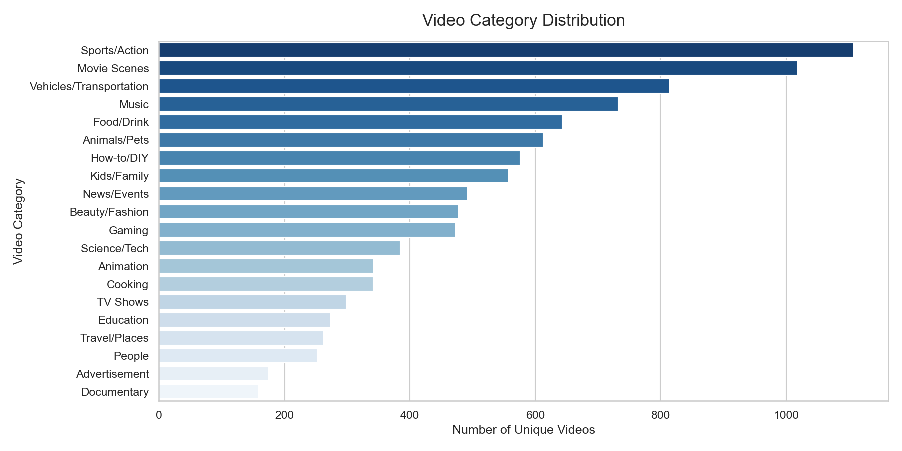
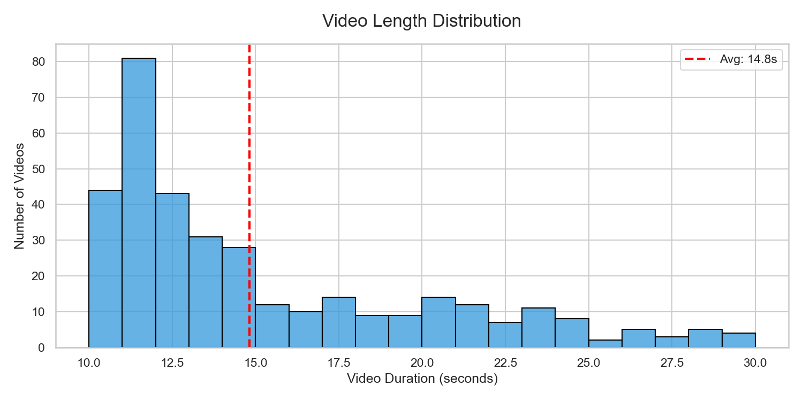
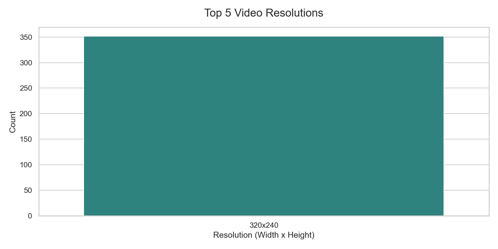
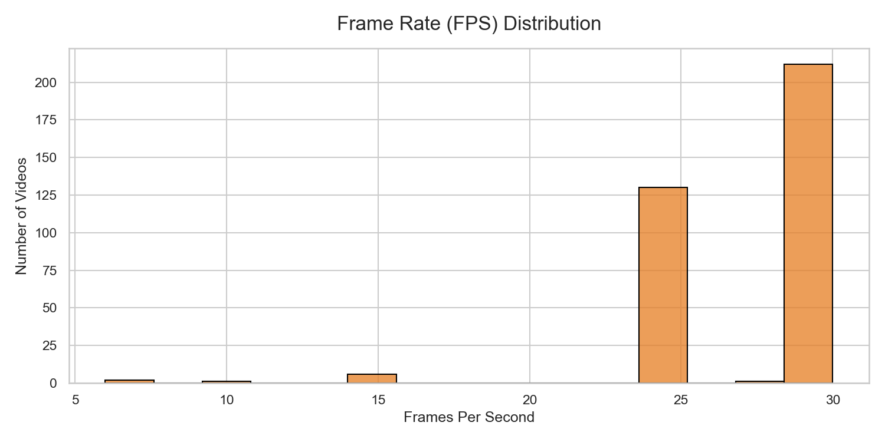
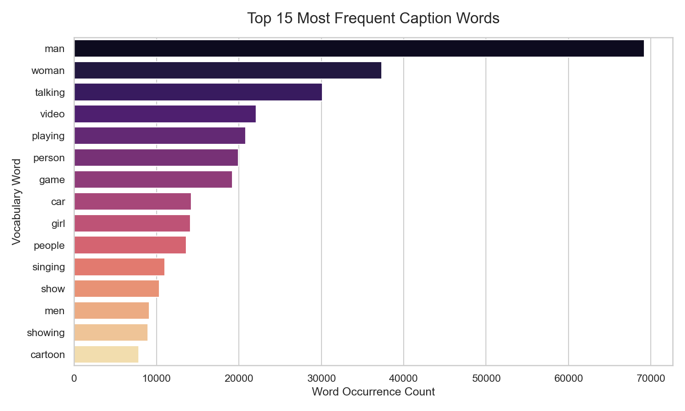
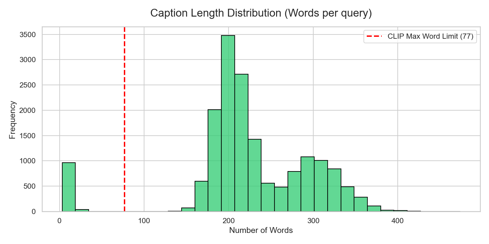

# Exploratory Data Analysis Results

This document summarizes the revised visual and textual data attributes of the MSR-VTT dataset.

## 1. Visual Dimensions

**Sampling**: Video metrics were sampled from a subset for rapid analysis.
- **Most Common Resolution**: `320x240`
- **Average Frame Rate**: `27.5` FPS
- **Average Exact Duration**: `14.8` seconds

### Standardizing for CLIP
Given the spatial variance in resolutions, standardizing inputs to `224x224` spatially will be mandatory for Vision Transformers (ViT) feeding CLIP.
Furthermore, as average FPS is around 30 and average length is ~15 seconds, extracting every frame yields ~450+ frames per clip. A downsampling strategy (e.g., 1 frame per second) is imperative to avoid out-of-memory constraints during embedding.

## 2. Textual Linguistics

- **Compatibility with CLIP Limits (77 tokens)**: Only `~5.9%` of captions (as aggregated full-string combinations) natively map cleanly. Strict token truncation is mandatory.

*The vocabulary indicates heavy usage of generic descriptors (e.g., "man", "woman", "person"). Zero-shot retrieval on highly specific object nouns may exhibit lower confidence thresholds, relying heavily on generalized semantic boundaries.*
